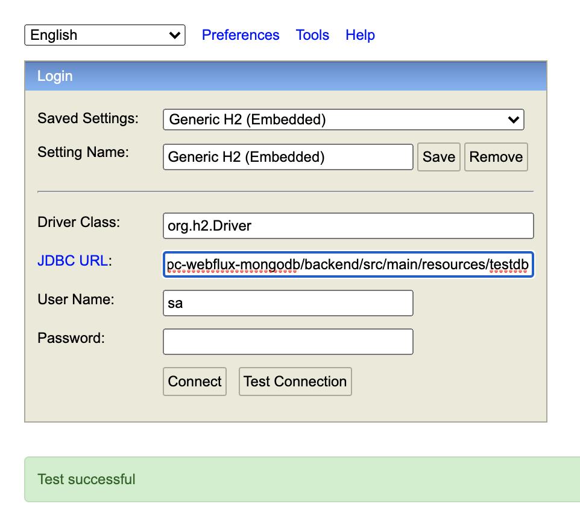
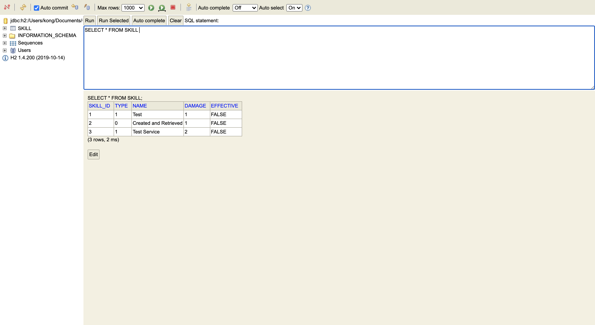

## Overview
A small project demonstrates how to use WebFlux (reactive programming), RxGprc (faster data coding and decoding), H2 r2dbc (in-memory reactive database).


## Build
From root project, move to the backend directory.
```sh
cd backend

```
Build and run all test cases.
```sh
./gradlew build

```

## H2 Console
Accesses the following url to login to the H2 Console.
```
http://localhost:8082

```

Change the JDBC URL as your absolute path to the `testdb.mv.db` in the project.
```sh
jdbc:h2:/<your_absolute_path>/grpc-webflux-mongodb/backend/src/main/resources/testdb

```



After successful login, you can make queries.

